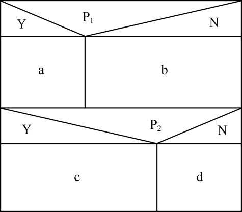
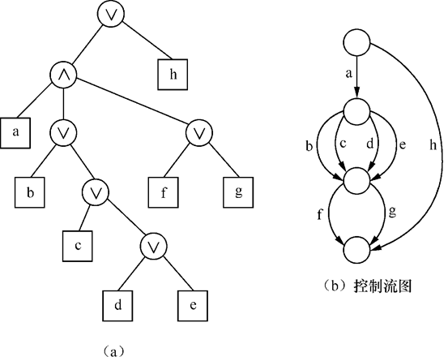
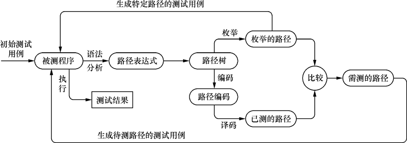
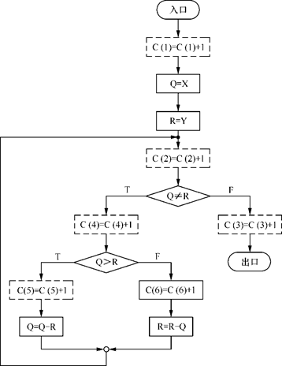

# 白盒测试

## 程序结构分析

### 控制流分析

#### 控制流图

在控制流图中只有以下两种图形符号。

1. 结点：以标有编号的圆圈表示。它代表了程序流程图中矩形框所表示的处理、菱形表示的两至多出口判断以及两至多条流线相交的汇合点。
2. 控制流线或弧：以箭头表示。它与程序流程图中的流线是一致的，表明了控制的顺序。为讨论方便，控制流线通常标有名字，如图中所标的a、b、c等。


<center style="font-size:14px;color:#C0C0C0;">程序流程图与控制流程图</center>

为便于在机器上表示和处理控制流图，我们可以把它表示成矩阵的形式，称为控制流图矩阵（control-flow graph matrix）。


<center style="font-size:14px;color:#C0C0C0;">控制流图矩阵</center>

这个矩阵有5行5列，是由该控制流图中含有5个结点决定的。矩阵中6个元素a、b、c、d、e和f的位置决定于它们所联接结点的号码。

#### 程序结构的基本要求

我们对于程序结构提出以下4点基本要求，这些要求是，写出的程序不应包含：

- 转向并不存在的标号；
- 没有用的语句标号；
- 从程序入口进入后无法达到的语句；
- 不能达到停机语句的语句。


<center style="font-size:14px;color:#C0C0C0;">检验不可达代码算法</center>

#### 结构分析

图中给出了最初由Dijkstra提出的几种结构化程序中若干逐步细化（stepwise refinement）的流程图构造形式。图中每个结点“E”均可扩充，由赋值号右边的结构所代换。


<center style="font-size:14px;color:#C0C0C0;">流程图语法</center>

### 数据流分析

#### 数据流问题

如果程序中某一语句执行时能改变某程序变量V的值，则称V是被该语句定义的。如果一语句的执行引用了内存中变量V的值，则说该语句引用变量V。

图中给出了一个小程序的控制流图，同时指明了每一语句定义和引用的变量。


<center style="font-size:14px;color:#C0C0C0;">控制流图及其定义和引用的变量</center>

该程序中含有两个错误：

- 语句2使用了变量W，而在此之前并未对其定义；
- 语句5、6使用变量V，这在第一次执行循环时也未对其定义过。

此外，该程序还包含两个异常：

- 语句6对Z的定义从未使用过；
- 语句8对W的定义也从未使用过。

#### 可达性定义

严格地说，变量V的定义是修改V值的一个程序语句。如果语句i是V的一个定义，我们可以用V<sub>i</sub>来表示这一定义。如果在控制流图中一路径并未对变量V定义，那么该路径就是变量V的明确定义。


如果从结点i到结点j的入口（或出口）变量V有一明确定义路径，定义V<sub>i</sub>便说成是达到了结点j的入口（或出口）。最后，我们说定义V<sub>i</sub>被说成是“杀掉”了那些达到结点i的变量的所有其他定义（保留了其他变量的所有定义）。


<center style="font-size:14px;color:#C0C0C0;">循环迭代算法</center>

#### 引用未定义变量

根据可达定义表，可按下述方法找出对未定义变量的引用。

对每一结点i，我们依次考虑语句i引用的每一变量，如果对任何这样的变量V，并没有V的定义达到i，那么程序含有一个错误。

#### 未曾使用的定义

可以用下面的方法找出未曾使用的定义。对于每一变量定义V<sub>i</sub> ，我们依次考虑由V<sub>i</sub>达到的每个程序结点j，如果没有引用变量V的相应语句，则程序中含有一个异常。

### 信息流分析


<center style="font-size:14px;color:#C0C0C0;">整除算法</center>


<center style="font-size:14px;color:#C0C0C0;">整除算法中输入值、语句与输出值的关系</center>

第一个表给出每一语句执行时所用到其输入值的变量。

第二个关系给出了其执行可能直接或间接影响输出变量终值的一些语句。可以看出，所有语句都可能影响到商Q的值。而语句1和语句4并未关系到余数R的值。

最后的关系表明了哪个输入值可能直接或间接影响输出变量。

## 逻辑覆盖

结构测试是依据被测程序的逻辑结构设计测试用例，驱动被测程序运行完成的测试。

结构测试中的一个重要问题是，测试进行到什么地步就达到要求，可以结束测试了。这就是说需要给出结构测试的覆盖准则。

### 几种常用的逻辑覆盖测试方法

#### 语句覆盖

语句覆盖的含意是，在测试时，首先设计若干个测试用例，然后运行被测程序，使程序中的每个可执行语句至少执行一次。这里所谓“若干个”，自然是越少越好。


<center style="font-size:14px;color:#C0C0C0;">被测程序段流程图</center>

如果测试用例：A=2,B=0,X=3。便可以达到语句覆盖，路径为ace。

如果测试用例：A=2,B=1,X=3。沿路径abe，未能达到语句覆盖。

如果第一个判断的AND写成OR，或者第二个的OR写成AND，仍然使用第一个参数用例，仍然做到语句覆盖，可是发现不了错误。

#### 判定覆盖

按判定覆盖准则进行测试是指，设计若干测试用例，运行被测程序，使得程序中每个判断的取真分支和取假分支至少经历一次，即判断的真假值均曾被满足。判定覆盖又称为分支覆盖。

使用A=2,B=1,X=1。可以判定覆盖。可是第二个判断X>1错写成X<1，不能发现错误。

#### 条件覆盖

条件覆盖是指设计若干测试用例，执行被测程序以后，要使每个判断中每个条件的可能取值至少满足一次。

我们给出3个测试用例：CASE6、CASE7、CASE8，执行该程序段所走路径及覆盖条件如表所示。


<center style="font-size:14px;color:#C0C0C0;">测试用例CASE6、CASE7、CASE8</center>

这组测试用例不但覆盖了所有的4个条件的8种情况，而且覆盖了两个判断的4个分支。但是并不意味着满足条件覆盖，就一定满足判定覆盖，例如下例：


<center style="font-size:14px;color:#C0C0C0;">测试用例CASE9、CASE8</center>

#### 判定-条件覆盖

判定-条件覆盖要求设计足够的测试用例，使得判断中每个条件的所有可能至少出现一次，并且每个判断本身的判定结果也至少出现一次。


<center style="font-size:14px;color:#C0C0C0;">测试用例CASE1、CASE8</center>

以上4个测试用例，覆盖了条件组合和判定组合（分支），但是漏掉了路径acd。

#### 路径覆盖

按路径覆盖要求进行测试是指，设计足够多的测试用例，要求覆盖程序中所有可能的路径。


<center style="font-size:14px;color:#C0C0C0;">被测程序段的路径</center>

针对前面的例子中的4条可能路径，将ace记为L<sub>1</sub>，abd记为L<sub>2</sub>，abe记为L<sub>3</sub>，acd记为L<sub>4</sub>，我们给出4个测试用例：CASE1、CASE7、CASE8和CASE11，使其分别覆盖这4条路径，如表所示。


<center style="font-size:14px;color:#C0C0C0;">测试用例CASE1、CASE7、CASE8、CASE11</center>

### 最少测试用例数计算

结构化程序是由3种基本控制结构组成。

这3种基本控制结构就是顺序型（构成串行操作）、选择型（构成分支操作）、重复型（构成循环操作）。

为了把问题化简，避免出现测试用例极多的组合爆炸，把构成循环操作的重复型结构用选择结构代替。


<center style="font-size:14px;color:#C0C0C0;">N-S图表示的基本控制结构</center>

上图给出了类似于流程图的N-S图表示的基本控制结构（图中A、B、C、D、S均表示要执行的操作，P是可取真假值的谓词，Y表真值，N表假值）。

其中图（c）和图（d）两种重复型结构代表了两种循环。



<center style="font-size:14px;color:#C0C0C0;">两个串行的分支结构的N-S图</center>

上图表达了两个顺序执行的分支结构。两个分支谓词P<sub>1</sub>和P<sub>2</sub>取不同值时，将分别执行a或b及c或d操作。

显然，要测试这个小程序，需要至少提供4个测试用例才能做到逻辑覆盖。

使得ac、ad、bc及bd操作均得到检验。其实，这里的4是图中第1个分支谓词引出的两个操作及第2个分支谓词引出的两个操作组合起来而得到的即2 × 2 = 4，并且，这里的2是由于两个并列的操作1 + 1 = 2而得到的。


<center style="font-size:14px;color:#C0C0C0;">计算最少测试用例数实例</center>


<center style="font-size:14px;color:#C0C0C0;">最少测试用例数计算</center>

上层：5*3+1=16

下层：3

共：16*3=48

### 测试覆盖准则

#### FOSTER的ESTCA覆盖准则

【规则1】 对于A rel B（rel可以是＜、 = 和＞）型的分支谓词，应适当地选择A与B的值，使得测试执行到该分支语句时，A＜B、A = B和A＞B的情况分别出现一次。
【规则2】　对于A rel<sub>1</sub> C（rel1可以是＜或是＞，A是变量，C是常量）型的分支谓词，当rel<sub>1</sub>为＜时，应适当地选择A的值，使
$$
A=A-M
$$
（M是距C最小的机器容许正数，若A和C均为整型时，M = 1）。同样，当rel1为＞时，应适当地选择A，使
$$
A=C+M
$$
【规则3】  对外部输入变量赋值，使其在每一测试用例中均有不同的值与符号，并与同一组测试用例中其他变量的值与符号不一致。

#### Woodward等人的层次LCSAJ覆盖准则

LCSAJ（Linear Code Sequence and Jump）的含义是线性代码序列与跳转。

一个LCSAJ是一组顺序执行的代码，以控制流跳转为其结束点。它不同于判断－判断路径。

判断－判断路径是根据程序有向图决定的。一个判断－判断路径是指两个判断之间的路径，但其中不再有判断。

但是LCSAJ却不这样要求，根据程序本身决定的，几个首尾相连的LCSAJ就组成了一条路径。

LCSAJ覆盖准则，这是一个分层的覆盖准则：

- [第一层]语句覆盖。
- [第二层]分支覆盖。
- [第三层]LCSAJ覆盖，即程序中的每一个LCSAJ都至少在测试中经历过一次。
- [第四层]两两LCSAJ覆盖，即程序中每两个首尾相连的LCSAJ组合起来在测试中都要经历一次。
- [第n + 2层]每n个首尾相连的LCSAJ组合在测试中都要经历一次。

## 域测试

域测试（Domain Testing）是一种基于程序结构的测试方法。

### 方法简介

Howden曾对程序中出现的错误进行分类。他将程序错误分为域错误、计算型错误和丢失路径错误三种。这是相对于执行程序的路径来说的。

为了域测试的方便，White和Cohen对被测程序规定了一些限制，这些限制是：

1. 程序中不出现数组。
2. 程序中不含有子函数或子例程。
3. 程序中没有输入和输出错误。
4. 程序的分支谓词是简单谓词，即它不含有布尔运算符AND和OR。
5. 程序分支谓词是线性的。
6. 程序输入域是连续的，而不是离散的。
7. 相邻的两个域（路径）上的计算是不相同的。

域测试的“域”指的是程序的输入空间。域测试方法基于对输入空间的分析。自然，任何一个被测程序都有一个输入空间。

测试的理想结果就是检验输入空间中的每一个输入元素是否都产生正确的结果。

而输入空间又可分为不同的子空间，每一子空间对应一种不同的计算。

在考察被测程序的结构以后，我们就会发现，子空间的划分是由程序中分支语句中的谓词决定的。

输入空间的一个元素经过程序中某些特定语句的执行而结束（当然也有可能出现无限循环而无出口），那都是满足了这些特定语句被执行所要求的条件的。

域测试正是在分析输入域的基础上选择适当的测试点以后进行测试的。

### 输入域结构


<center style="font-size:14px;color:#C0C0C0;">说明输入域的程序实例</center>

这里结合一个短的程序（如图所示）说明输入域的分割。
程序中包含三个条件语句的谓词。

- 谓词1：I＜＝J+1
- 谓词2：K＞＝I+1
- 谓词3：I＝5


<center style="font-size:14px;color:#C0C0C0;">输入空间的划分</center>

### 测试点的选择

有两类测试点可供选择，一类称作ON点，这类测试点位于域的边界上；另一类称作OFF点，它离边界有一个小距离ε，并在被测域之外。


<center style="font-size:14px;color:#C0C0C0;">线性边界的测试</center>

上图给出了测试点的选择方案。

其中AB是测试输入空间某一子空间的一条边界（由被测程序决定），PQ是程序正确时实际边界的位置。

A、B是两个ON点，C点是一个OFF点，离AB边界的距离是ε。


<center style="font-size:14px;color:#C0C0C0;">边界位移的三种基本类型</center>

可以将边界位移分为三类，如图所示。该图（a）中边界位移使得域D1减小，测试点A、B将给出正确结果。图（b）中边界位移使得D1增大，测试点C将给出正确结果，而测试点A、B将给出错误结果。

在子图（c）中，测试点A、C将给出正确结果，而测试点B将给出错误结果。

但需注意，判断测试点是否给出正确结果的依据是此测试点是否属于其应属的域中。

这表明，ON-OFF-ON这种交错取点法对边界位移错误是相当有效的。

域测试的步骤可归结如下：

1. 根据各分支谓词，画出域分割图。
2. 对每一个域的每一个边界用ON-OFF-ON原则选取测试点进行测试。
3. 在域内取一些点进行测试。

### 划分分析

域测试的一种变形是D.J.Richardson和L.A.CLarke提出的划分分析（Partition Analysis）。这是程序测试与程序验证结合的方法。

## 符号测试

### 符号测试方法概述

普通测试执行的是算术运算，符号测试则是执行代数运算，可以代表一类的测试，而不用选用具体的数值数据进行大量的普通测试。

符号值可以是初等符号值，也可以是表达式。

初等符号是任何变量值的字符串，表达式则是数字、算术运算符和符号值的组合。

下面短程序中可看到过程SAMPLE的变量符号值

```
Procedure SAMPLE(X,Y)
    S=2*X+3*Y
    T=S-Y
    RETURN
    END
```

### 符号执行树

取符号值作输入数据，在执行程序的过程中，如果遇到条件语句

```
IF<谓词>THEN…
	ELSE…
```

这里的谓词可能是符号表达式，可以取真值和假值，一般情况下都要保留。不断构造下去，构成了一个二叉树，称为符号执行树。

将各个分支点的谓词条件累积在一起，用逻辑乘符号联接在一起，得到的这个逻辑表达式称为路径条件。


<center style="font-size:14px;color:#C0C0C0;">求最大公因数程序流程图</center>


<center style="font-size:14px;color:#C0C0C0;">求最大公因数程序的符号执行树</center>

### 符号测试方法评述

符号测试可以看作是程序测试与程序验证的一个折衷方法。

一方面，它沿用了传统的程序测试方法，通过运行被测程序来检验它的可靠性。

另一方面，由于一次符号测试的结果代表了一大类普通测试的运行结果，实际上是证明了程序接受此类输入，所得输出是正确的，还是错误的。

从符号测试方法使用看，问题的关键在于开发出比传统的编译器功能更强，能够处理符号运算的编译器或解释器。

在实际运用时符号测试可按以下步骤进行：

1.  利用符号执行解释器对被测程序进行符号执行。
2. 若是遇到程序不能继续执行的情况，要求用户干预，或是遍历执行树的各分支路径。
3. 化简得到路径条件式。
4. 用解线性不等式方法求解路径条件式，以求得满足各个限制谓词的测试数据。
5. 对程序进行测试，若上述不等式无解，则相应的路径不可执行。

符号测试方法在使用中会遇到一些问题，这些问题到目前为止尚未得到圆满的解决，因而就严重地影响着它的发展前景。

1. 分支问题。
2. 二义性问题。
3. 大程序问题。

## 路径分析

分析程序中的路径是指：检验程序从入口开始，执行过程中经历的各个语句，直到出口。这是白盒测试最为典型的问题。

着眼于路径分析的测试可称为路径测试，完成路径测试的理想情况是做到路径覆盖。

### 程序路径表达式

进行路径分析，首先要解决的是路径如何表示的问题。以下给出几种表示方法。这些方法应该比较直观、形象，以利于人们理解，同时还必须能够容易在计算机中处理。

#### 路径的弧序列表示及结点序列表示


<center style="font-size:14px;color:#C0C0C0;">路径的弧序列表示和结点序列表示</center>

#### 路径表达式（path expression）


<center style="font-size:14px;color:#C0C0C0;">两个简单程序的控制流及其路径</center>

路径表达式作为一种表达式，其运算对象指的是控制流图中的弧，此外引入两个运算：乘和加。

弧a和弧b相乘，所得的乘积为ab，它表示先沿弧a再沿弧b所经历的路段。注意，这里也同代数式一样，事实上省略了a和b之间的乘法运算符。

其实这就是前面给出的弧序列表示，形式上没有什么不一样，不过这时我们应该想到，各弧之间是一种相乘的关系。

例如，acde是四个弧的乘积，它表示沿着a、c、d和e的顺序所经历的路段。

路径表达式中的另一运算是加。弧a与弧b相加，其和a + b表示两弧是或的关系。如图（a）中结点2至结点3有两个弧相联，是并行的路段。这时运算符“ + ”是不可省的。

可以直观地看出在图（a）所表示的控制流中，共有4条路径，它们是eacf、eadf、ebcf和ebdf。这4条路径是并行的或的关系，我们完全可以用加运算联接它们，从而得到完整的路径表达式：

eacf + eadf + ebcf + ebdf

另一方面，还可直接从该图中看出，既然弧a和弧b是并行的，弧c和弧d也是并行的，它们的头尾又有弧e和弧f相联。

我们按上述两种运算的定义可立即写出路径表达式：

e(a + b)(c + d)f

### 程序中路径数的计算

#### 路径表达式计算

假定所讨论的程序已经得到了它的路径表达式，则可把其中的所有弧均代以数值“1”，然后依表达式的乘法和加法运算，所得数值即为该程序的路径数。

#### 程序复杂度计算

$$
V(G)=E-n+2
$$

E:边数

n:节点数

V(G):复杂度


<center style="font-size:14px;color:#C0C0C0;">程序复杂度计算实例</center>

表给出了几个简单控制流图所表示程序的复杂性计算实例。

其中前4个是基本控制结构，第5个是含有循环的小程序。需要提请注意的是计算出的复杂度值V恰是其控制流图中含有菱形判断的个数加1。

同时，这个值也等于控制流图中控制流线把整个图的平面分割的域数。

例如，表中的第5个控制流图，其中有3个判断，V值为4；并且控制流线将平面分割成4个域（I、II、III和IV）。

#### 独立路径数

某一程序的独立路径是从程序入口到出口的多次执行中，每次至少一个语句（包括运算、赋值、输入输出或判断）是新的，未被重复的。

如果用前面提到的控制流图来描述，独立路径就是在从入口进入控制流图后，至少要经历一个从未走过的弧。


<center style="font-size:14px;color:#C0C0C0;">程序流程图和控制流图</center>

上图是一个程序的流程图和控制流图。我们可以从图中看出它的4条独立路径（这里用结点序列表示）：

1. 1-11
2. 1-2-3-4-5-10-1-11
3. 1-2-3-6-8-9-10-1-11
4. 1-2-3-6-7-9-10-1-11

以上四条路径画有底线的部分是相对于前次执行来说尚未走过的部分。

### 程序路径的树表示及路径编码

#### 路径“与/或”树及其特征



<center style="font-size:14px;color:#C0C0C0;">路径“与/或”树与控制流图</center>

1. 对路径树中任一结点N，设其进入端个数为u，流出端分支个数为v，我们用N(u，v）来表示该结点（如下图所示）。


<center style="font-size:14px;color:#C0C0C0;">结点N(u，v)</center>

2. 路径树中有且仅有一个根结点。
3. 路径树中每一叶结点都对应了它的程序控制流图中的一个弧；反之程序流程图中的任一控制流线也都对应了树中的一个叶结点。
4. 路径树中任一非根结点N（u，v），其进入端个数u必定为1。

#### 简化路径树

为了便于对路径树的处理，使之易于利用计算机实现对它的遍历和搜索，最终实现路径测试，我们需要将上述路径树作进一步简化。


<center style="font-size:14px;color:#C0C0C0;">路径树的简化 </center>

简化处理主要包括以下三个方面：

1. 如果路径树中某AND结点的子结点中仍然有AND结点，就将孙结点提到子结点的位置，并去掉该AND子结点。按照这一原则，我们把图中的（a）图简化成（b）图。
2. 如果路径树中某OR结点的子结点中仍然有OR结点，就将孙结点也提到子结点的位置来，并且去掉该OR子结点。按照这一原则，可以把图的（c）图简化成（d）图。
3. 如果路径树的AND结点有一子结点是叶结点，我们可将此叶结点合并到其左、右邻结点中，进而消除AND结点和该叶结点构成的分支。


<center style="font-size:14px;color:#C0C0C0;">路径的简化</center>

在上图中，若A为一叶结点，它的相邻结点可能有以下几种情况：

- 相邻结点也是叶结点，如B结点，则可简化成AB结点，如图（a）所示。


- 相邻结点是OR结点；如它联结了B、C、D叶结点，则可将A“乘”入这些叶结点，从而简化成AB、AC和AD三个叶结点，如图（b）所示。

- 相邻结点是AND结点，例如，它联结了B和C叶结点，那么我们可将“乘”入该AND结点的最左叶结点，使得它的叶结点变成AB和C，如图（c）所示。 

任何路径树经过上述规则的简化都会具有新的特征，即每一OR结点的任一分支都不再是OR结点，并且每一AND结点的任一分支都不再是AND结点，很可能是OR结点。


<center style="font-size:14px;color:#C0C0C0;">简化后的路径树 </center>

上图便是路径树的简化形式。

#### 路径编码

以下给出路径编码的方法。

1. 路径树中每一OR结点的出端分支编码

   若OR结点的出端分支个数为v，其第i出端分支的编码为十进制数i − 1的L位二进制码。其中，L = [Log<sub>2</sub>(v − 1) + 1]，这里方括号为取整运算。
   
   
   
   <center style="font-size:14px;color:#C0C0C0;">OR结点出端的编码</center>
   
   上图给出了出端在5以内的编码。

2. 路径的编码

   在对路径树的所有OR结点的出端进行编码以后，任一路径的编码是从根结点出发遍历该路径各叶结点而后回到根结点经历的所有OR结点出端编码的序列。
   
   
   
   <center style="font-size:14px;color:#C0C0C0;">路径编码</center>
   
   作为实例，上图给出了路径的编码。
   
   
   
   <center style="font-size:14px;color:#C0C0C0;">简化树的路径编码</center>
   
   对于简化了的路径树，我们可以得到类似的结果（参看上图）。但要特别注意，由于简化树不同于原来的路径树，其编码值也是不同的。

#### 路径译码

与路径编码的过程相反，在给出某个路径编码以后，找到与其对应的程序路径，我们称这一逆过程为路径译码。

### 测试路径枚举

#### Z路径覆盖

简化循环意义下的路径覆盖称为Z路径覆盖。限定循环次数为0次或一次，相当于将循环结构化为选择结构。


<center style="font-size:14px;color:#C0C0C0;">循环结构简化成选择结构</center>

#### 路径枚举

### 路径测试系统



<center style="font-size:14px;color:#C0C0C0;">路径测试系统</center>

获得测试用例的途径：

1. 通过非路径分析得到的测试用例
2. 找到尚未测过的路径并生成相应的测试用例
3. 指定特定路径生成相应的测试用例

## 程序插装

程序插装（Program lnstrumentation）是一种基本的测试手段，在软件测试中有着广泛的应用。

### 方法简介

程序插装方法简单地说是通过往被测程序中插入操作来实现测试目的的方法。



<center style="font-size:14px;color:#C0C0C0;">插装后的求最大公约数程序流程图</center>

程序从入口开始执行，到出口结束。凡经历的计数语句都能记录下该程序点的执行次数。

如果我们在程序的入口处还插入了对计数器C(i)初始化的语句，在出口处插入了打印这些计数器的语句，就构成了完整的插装程序。

它便能记录并输出在各程序点上语句的实际执行次数。


<center style="font-size:14px;color:#C0C0C0;">插装程序中插入的语句</center>

上图表示了插装后的程序，图中箭头所指均为插入的语句（原程序的语句已略去）。

设计程序插装程序时需要考虑的问题包括：

1. 探测哪些信息；
2. 在程序的什么部位设置探测点；
3. 需要设置多少个探测点。

#### 断言语句

有时在程序中的特定部位插入某些用以判断变量特性的语句，使得程序执行中这些语句得以证实，从而使程序的运行特性得到证实，我们把插入的这些语句称为为断言（assertions）。

这一做法是程序正确性证明的初等步骤，尽管算不上严格的证明，但方法本身仍然是很实用的。

### 程序变异

程序变异方法（Program Mutation）与前面提到的结构测试和功能测试都不一样，它是一种错误驱动测试。

所谓错误驱动测试方法，是指该方法是针对某类特定程序错误的。经过了若干年的测试理论研究和软件测试的实践，人们逐渐发现要想找出程序中所有的错误几乎是不可能的。

比较现实的解决办法是将错误的搜索范围尽可能地缩小，以利于专门测试某类错误是否存在。这样做的好处在于，便于集中目标于对软件危害最大的可能错误，而暂时忽略对软件危害较小的可能错误。这样可以取得较高的测试效率，并能降低测试的成本。

#### 程序强变异

程序强变异通常被简称为程序变异。它是由R. A. DeMillo和T. A. Budd等人最早提出的。Demillo认为，当程序被开发并经过简单测试后，残留在程序中的错误不再是那些很重大的错误，而是一些难以发现的小错误。

即使是一些稍微复杂一些的错误，也可以看作是这些简单错误的组合。程序变异的目标就是查出这些简单的错误及其组合。

程序变异意味着对测试数据集中的每一元素，都要对程序P及其变异因子进行测试，所以要求测试数据集D和变异因子集m（P）都需精心挑选。这是强变异方法成功的关键。

m（P）是对P进行微小改动得到的，也是一个程序，称为P的变异因子。

假设P有测试数据集D，若P在D上是正确的，可以找出P的变异因子的某一集合M={M(P)|M(P)是P的变异因子}，若M中每一元素在D上都存在错误，则认为程序的正确程度较高。

若M中某些元素在D上不存在错误，则可能存在三种情况：

1. 这些变异因子与P在功能上是等价的；
2. 现有的测试数据不足以找出P与其变异因子间的差别；
3. P可能含有错误，而其某些变异因子却是正确的；

要极力避免第一种情况，第二种情况需要增加测试数据，第三种情况表明当许多典型的测试数据仍然不能使某一变异因子出错时，此变异因子可能是程序的正确形式。

Budd曾列出了如下一些常用的变异运算：

- 常量之间替换；
- 标量与变量替换；
- 将常量替换为标量；
- 将标量替换为常量；
- 将常量替换为数组分量；
- 将标量替换为数组分量；
- 将数组分量替换为常量；
- 将数组分量替换为标量；
- 数组分量之间替换；
- 数组名替换；
- 算术运算符替换；
- 关系运算符替换；
- 逻辑运算符替换；
- 插入绝对值符号；
- 插入单目运算符；
- 语句分解；
- 语句删除；
- GO TO；
- 循环终止条件变换。

程序变异方法也有两大弱点。一是要运行所有的变异因子，从而成倍地提高了测试的成本；二是决定程序与其变异因子是否等价是一个递归不可解问题。

但不管怎样，程序变异由于其针对性强、系统性强，正成为软件测试中一种相当活跃的办法。特别是在变异测试系统的支持下，用户可以更有效地测试自己的程序。

#### 程序弱变异

程序弱变异方法（Weak Mutation）是Howden提出的。

由于程序强变异要生成变异因子，为与此相区别，Howden称只是对被测程序进行测试的变异方法为弱变异，与强变异的区别在于：强变异是产生实际的变异因子，而弱变异并不产生，而只是选择测试数据，使得变异前后程序部件产生不同的值。

Howden提出了5种最基本的程序组成部分：变量引用、变量定义、算术表达式、关系表达式和布尔表达式。

##### 变量引用

变量引用包括变量值的使用。如在语句

A = B + A

中，变量B被引用，变量A则先被引用，继而又被定义。再如语句

if  (A>B)

中，A、B的值均被引用，这些语句是变量引用组成部分。

##### 变量定义

变量定义指的是给变量赋以新值。如在语句A = B中，变量A被赋予新值B，我们称此为A被定义了，此语句被称为变量定义组成部分。

##### 算术表达式

算术表达式的弱变异考虑三类常见错误：表达式与正确表达式相差一个常数；表达式是正确表达式的常数倍；表达式的系数有错误。实际上，后一种情况包括了前两种情况。但由于前两种情况要求较少的测试数据，因而将其单独分类。

##### 算术关系

算术关系的弱变异考虑两类简单的错误：关系运算符错与相差一个常数的错误。

设R是一个算术关系，R'是有错误关系运算符的R的一个变换，即

$$
R=exp_1 \space r\space exp_2
$$
而

$$
R'=exp_1 \space r'\space exp_2
$$
但r≠r'。

那么只要选择测试数据，使
$$
exp_1<exp_2,exp_1>exp_2,exp_1=exp_2
$$
的情况都出现一次，那么R和R’的真值总会在某一组测试数据下不同。

对于相差一个常数的错误，可以设
$$
R=exp \space r\space 0
$$
其中，r是关系，那么
$$
R'=(exp+K) \space r\space 0
$$
其中K≠0。若r是<，则可取两组测试数据，一组是exp是小于零的最大可能值，另一组是exp是大于于等于零的最小可能值。如果K>0，第一组测试数据使得exp<0，而exp+K≥0，故能加以区别；如果K<0，第二组测试数据使得exp+K<0，exp ≥0，也能加以区别。同理其他符号如图所示。


<center style="font-size:14px;color:#C0C0C0;">对算术关系进行弱变异的测试数据</center>

##### 布尔关系

布尔关系是算术关系用NOT、AND和OR三个逻辑运算符连接起来的复杂关系。设B是一个布尔关系：
$$
B=L(E_1,E_2,…,E_n)
$$
其中，E<sub>i</sub>(i = 1，2，…，n)是算术关系，L是含有NOT、AND或OR运算符的逻辑表达式，B'为B的一个变换：
$$
B'=L'(E_1,E_2,…,E_n)
$$
则要使B与B'区别开来，必须取测试值，使得(E<sub>1</sub>, E<sub>2</sub>, …, E<sub>n</sub>)是各种不同的真值组合。

