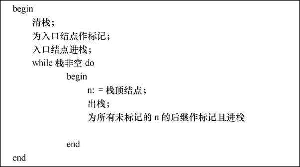

# 白盒测试

## 程序结构分析

### 控制流图

在控制流图中只有以下两种图形符号。

1. 结点：以标有编号的圆圈表示。它代表了程序流程图中矩形框所表示的处理、菱形表示的两至多出口判断以及两至多条流线相交的汇合点。
2. 控制流线或弧：以箭头表示。它与程序流程图中的流线是一致的，表明了控制的顺序。为讨论方便，控制流线通常标有名字，如图中所标的a、b、c等。

程序流程图与控制流程图

为便于在机器上表示和处理控制流图，我们可以把它表示成矩阵的形式，称为控制流图矩阵（control-flow graph matrix）。

控制流图矩阵

这个矩阵有5行5列，是由该控制流图中含有5个结点决定的。矩阵中6个元素a、b、c、d、e和f的位置决定于它们所联接结点的号码。

### 程序结构的基本要求

我们对于程序结构提出以下4点基本要求，这些要求是，写出的程序不应包含：

- 转向并不存在的标号；
- 没有用的语句标号；
- 从程序入口进入后无法达到的语句；
- 不能达到停机语句的语句。

检验不可达代码算法

### 结构分析

图中给出了最初由Dijkstra提出的几种结构化程序中若干逐步细化（stepwise refinement）的流程图构造形式。图中每个结点“E”均可扩充，由赋值号右边的结构所代换。

流程图语法

## 数据流分析

### 数据流问题

如果程序中某一语句执行时能改变某程序变量V的值，则称V是被该语句定义的。如果一语句的执行引用了内存中变量V的值，则说该语句引用变量V。

图中给出了一个小程序的控制流图，同时指明了每一语句定义和引用的变量。

控制流图及其定义和引用的变量

该程序中含有两个错误：

- 语句2使用了变量W，而在此之前并未对其定义；
- 语句5、6使用变量V，这在第一次执行循环时也未对其定义过。

此外，该程序还包含两个异常：

- 语句6对Z的定义从未使用过；
- 语句8对W的定义也从未使用过。

### 可达性定义

严格地说，变量V的定义是修改V值的一个程序语句。如果语句i是V的一个定义，我们可以用Vi来表示这一定义。如果在控制流图中一路径并未对变量V定义，那么该路径就是变量V的明确定义。

