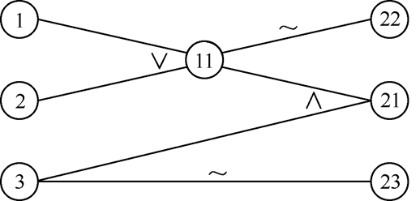
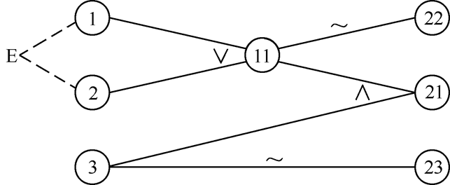
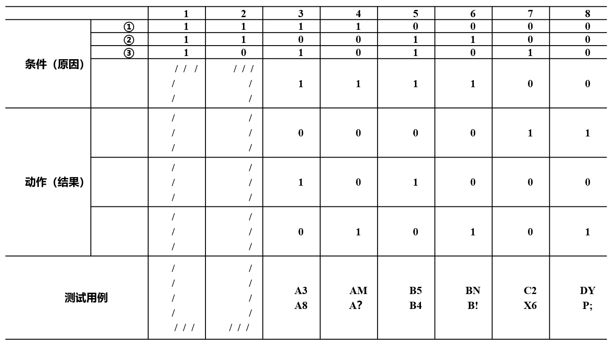
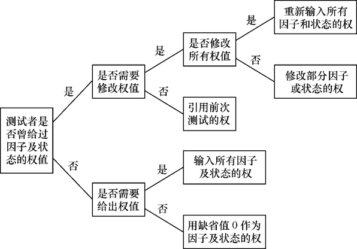

# 黑盒测试

## 等价类划分

等价类划分是一种典型的黑盒测试方法，用这一方法设计测试用例完全不考虑程序的内部结构，而是只根据对程序的要求和说明，即平时我们常常说的需求规格说明书，我们必须仔细分析和推敲说明书的各项需求，特别是功能需求。把说明中对输入的要求和输出的要求区别开来并加以分解。

### 方法简介

#### 1. 划分等价类

首先把数目极多的输入情况划分成若干个等价类。所谓等价类是指某个输入域的集合。它表示，如果用集合中的一个输入条件作为测试数据进行测试不能发现程序中的错误，那么使用集合中的其他输入条件进行测试也不可能发现错误。

- 有效等价类：有效等价类指的是对程序的规格说明是有意义的、合理的输入数据所构成的集合。在具体问题中，有效等价类可以是一个，也可以是多个。
- 无效等价类：无效等价类指对程序的规格说明是不合理的或无意义的输入数据所构成的集合。对于具体的问题，无效等价类至少应有一个，也可能有多个。

##### 确定等价类的原则：

1. 如果输入条件规定了取值范围或值的个数，则可确定一个有效等价类和两个无效等价类。
2. 输入条件规定了输入值的集合，或是规定了“必须如何”的条件，则可确定一个有效等价类和一个无效等价类。
3.  如果我们确知，已划分的等价类中各元素在程序中的处理方式是不同的，则应将此等价类进一步划分成更小的等价类。

##### 等价类表：

| 输入条件 | 有效等价类 | 无效等价类 |
| -------- | ---------- | ---------- |
| ……       | ……         | ……         |

#### 2. 确定测试用例

步骤：

1. 为每个等价类规定一个唯一的编号。
2. 设计一个测试用例，使其尽可能多地覆盖尚未覆盖的有效等价类。重复这一步，最后使得所有有效等价类均被测试用例所覆盖。
3. 设计一个新的测试用例，使其只覆盖一个无效等价类。重复这一步使所有无效等价类均被覆盖。

### 应用等价类划分方法进行测试用例设计的实例（P50）

## 因果图

利用因果图导出测试用例的步骤：

1.  分析程序规格说明的描述中，哪些是原因，哪些是结果。原因常常是输入条件或是输入条件的等价类，而结果是输出条件。
2. 分析程序规格说明的描述中语义的内容，并将其表示成连接各个原因与各个结果的“因果图”。
3. 由于语法或环境的限制，有些原因和结果的组合情况是不可能出现的。为表明这些特定的情况，在因果图上使用若干个特殊的符号标明约束条件。
4. 把因果图转换成判定表。
5. 把判定表中每一列表示的情况写成测试用例。

因果图的基本符号

图中ci表示原因，通常置于图的左部；ei表示结果，通常在图的右部。ci和ei均可取值0或1，0表示某状态不出现，1表示某状态出现。

1. 恒等：若c1是1，则e1也是1；否则e1为0。
2. 非：若c1是1，则e1是0；否则e1是1。
3. 或：若c1或c2或c3是1，则e1是1；否则e1为0。“或”可有任意个输入。
4. 与：若c1和c2都是1，则e1为1；否则e1为0。“与”也可有任意个输入。

约束符号

对于输入条件的约束有以下4类。

1. E约束（异）：a和b中至多有一个可能为1，即a和b不能同时为1。
2. I约束（或）：a、b和c中至少有一个必须是1，即a、b和c不能同时为0。
3. O约束（唯一）：a和b必须有一个，且仅有1个为1。
4. R约束（要求）：a是1时，b必须是1，即不可能a是1时b是0。

对于输出条件的约束有1类：

​		M约束（强制）：若结果a是1，则结果b强制为0。

例：某个软件的规格说明书包含这样的要求：第一列字符必须是A或者B，第二列字符必须是一个数字，在此情况下进行文件的修改，但如果第1列字符不正确，则给出信息L；如果第2列字符不是数字，则给出信息M。

原因：
    1：第一列字符是A；
    2：第一列字符是B；
    3：第二列字符是数字；
结果：
    21：进行文件的修改；
    22：给出信息L；
    23：给出信息M。

因果图示例

具有E约束的因果图

判定表

## 正交实验设计法

所谓正交实验设计法，是从大量的实验点中挑选出适量的、有代表性的点，应用依据伽罗瓦理论导出的“正交表”合理地安排实验的一种科学的实验设计方法。利用这种方法，可使所有的因子和水平在实验中均匀地分配与搭配，均匀规律地变化。

### 提取功能说明，构造因子——状态表

软件的功能测试是基于被测软件的规格说明书来进行的测试，因此，在测试前必须准备好完整的、准确的被测软件各种功能的详细说明，否则，将无法进行测试结果的分析、比较，更无法得到准确的测试结论。

### 加权筛选，生成因素分析表

在不同测试阶段对因子及状态的权值的输入、改变都会有不同的要求。
必须考虑各个测试阶段可能出现的各种情况分别进行处理。

权值处理流程

在确定了各因子及状态的权值ωi之后，便开始进行权比例ri计算。
$$
r_i=\frac{\omega_i}{SUM}(i=1,2,...n)
$$
可选择筛选标准1/2n作为权比例标准值，若
$$
r_i>\frac{1}{2n}
$$
则保留该因子，否则舍去该因子，对于因子状态也可用同样的方法进行筛选。

### 利用正交表构造测试数据集