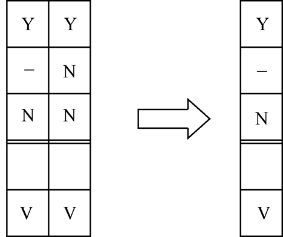
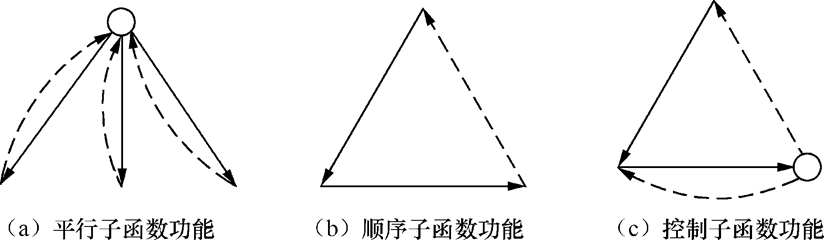

# 黑盒测试

## 等价类划分

等价类划分是一种典型的黑盒测试方法，用这一方法设计测试用例完全不考虑程序的内部结构，而是只根据对程序的要求和说明，即平时我们常常说的需求规格说明书，我们必须仔细分析和推敲说明书的各项需求，特别是功能需求。把说明中对输入的要求和输出的要求区别开来并加以分解。

### 方法简介

#### 1. 划分等价类

首先把数目极多的输入情况划分成若干个等价类。所谓等价类是指某个输入域的集合。它表示，如果用集合中的一个输入条件作为测试数据进行测试不能发现程序中的错误，那么使用集合中的其他输入条件进行测试也不可能发现错误。

- 有效等价类：有效等价类指的是对程序的规格说明是有意义的、合理的输入数据所构成的集合。在具体问题中，有效等价类可以是一个，也可以是多个。
- 无效等价类：无效等价类指对程序的规格说明是不合理的或无意义的输入数据所构成的集合。对于具体的问题，无效等价类至少应有一个，也可能有多个。

##### 确定等价类的原则：

1. 如果输入条件规定了取值范围或值的个数，则可确定一个有效等价类和两个无效等价类。
2. 输入条件规定了输入值的集合，或是规定了“必须如何”的条件，则可确定一个有效等价类和一个无效等价类。
3.  如果我们确知，已划分的等价类中各元素在程序中的处理方式是不同的，则应将此等价类进一步划分成更小的等价类。

##### 等价类表：

| 输入条件 | 有效等价类 | 无效等价类 |
| -------- | ---------- | ---------- |
| ……       | ……         | ……         |

#### 2. 确定测试用例

步骤：

1. 为每个等价类规定一个唯一的编号。
2. 设计一个测试用例，使其尽可能多地覆盖尚未覆盖的有效等价类。重复这一步，最后使得所有有效等价类均被测试用例所覆盖。
3. 设计一个新的测试用例，使其只覆盖一个无效等价类。重复这一步使所有无效等价类均被覆盖。

### 应用等价类划分方法进行测试用例设计的实例（P50）

## 因果图

利用因果图导出测试用例的步骤：

1.  分析程序规格说明的描述中，哪些是原因，哪些是结果。原因常常是输入条件或是输入条件的等价类，而结果是输出条件。
2. 分析程序规格说明的描述中语义的内容，并将其表示成连接各个原因与各个结果的“因果图”。
3. 由于语法或环境的限制，有些原因和结果的组合情况是不可能出现的。为表明这些特定的情况，在因果图上使用若干个特殊的符号标明约束条件。
4. 把因果图转换成判定表。
5. 把判定表中每一列表示的情况写成测试用例。


<center style="font-size:14px;color:#C0C0C0;">因果图的基本符号</center>

图中c<sub>i</sub>表示原因，通常置于图的左部；e<sub>i</sub>表示结果，通常在图的右部。c<sub>i</sub>和e<sub>i</sub>均可取值0或1，0表示某状态不出现，1表示某状态出现。

1. 恒等：若c<sub>1</sub>是1，则e<sub>1</sub>也是1；否则e<sub>1</sub>为0。
2. 非：若c<sub>1</sub>是1，则e<sub>1</sub>是0；否则e<sub>1</sub>是1。
3. 或：若c<sub>1</sub>或c<sub>2</sub>或c<sub>3</sub>是1，则e<sub>1</sub>是1；否则e<sub>1</sub>为0。“或”可有任意个输入。
4. 与：若c<sub>1</sub>和c<sub>2</sub>都是1，则e<sub>1</sub>为1；否则e<sub>1</sub>为0。“与”也可有任意个输入。


<center style="font-size:14px;color:#C0C0C0;">约束符号</center>

对于输入条件的约束有以下4类。

1. E约束（异）：a和b中至多有一个可能为1，即a和b不能同时为1。
2. I约束（或）：a、b和c中至少有一个必须是1，即a、b和c不能同时为0。
3. O约束（唯一）：a和b必须有一个，且仅有1个为1。
4. R约束（要求）：a是1时，b必须是1，即不可能a是1时b是0。

对于输出条件的约束有1类：

​		M约束（强制）：若结果a是1，则结果b强制为0。

例：某个软件的规格说明书包含这样的要求：第一列字符必须是A或者B，第二列字符必须是一个数字，在此情况下进行文件的修改，但如果第1列字符不正确，则给出信息L；如果第2列字符不是数字，则给出信息M。

原因：

​    1：第一列字符是A；

​    2：第一列字符是B；

​    3：第二列字符是数字；

结果：

​    21：进行文件的修改；

​    22：给出信息L；

​    23：给出信息M。


<center style="font-size:14px;color:#C0C0C0;">因果图示例</center>


<center style="font-size:14px;color:#C0C0C0;">具有E约束的因果图</center>


<center style="font-size:14px;color:#C0C0C0;">判定表</center>

## 正交实验设计法

所谓正交实验设计法，是从大量的实验点中挑选出适量的、有代表性的点，应用依据伽罗瓦理论导出的“正交表”合理地安排实验的一种科学的实验设计方法。利用这种方法，可使所有的因子和水平在实验中均匀地分配与搭配，均匀规律地变化。

### 提取功能说明，构造因子——状态表

软件的功能测试是基于被测软件的规格说明书来进行的测试，因此，在测试前必须准备好完整的、准确的被测软件各种功能的详细说明，否则，将无法进行测试结果的分析、比较，更无法得到准确的测试结论。

### 加权筛选，生成因素分析表

在不同测试阶段对因子及状态的权值的输入、改变都会有不同的要求。

必须考虑各个测试阶段可能出现的各种情况分别进行处理。


<center style="font-size:14px;color:#C0C0C0;">权值处理流程</center>

在确定了各因子及状态的权值ω<sub>i</sub>之后，便开始进行权比例r<sub>i</sub>计算。
$$
r_i=\frac{\omega_i}{SUM}(i=1,2,...n)
$$
可选择筛选标准1/2n作为权比例标准值，若
$$
r_i>\frac{1}{2n}
$$
则保留该因子，否则舍去该因子，对于因子状态也可用同样的方法进行筛选。

### 利用正交表构造测试数据集


<center style="font-size:14px;color:#C0C0C0;">正交表</center>

表中，每列表示一个因子，每行表示一个项目。

根据正交表的推导过程，可得正交表的生成规律如下。

1. 项目数完全是由因子个数决定的，而且总是2的整数次幂。

2. 设因子个数为m：

   则当m=2<sup>i-1</sup>-1时，项目数为2<sup>i-1</sup>（i≥2）；
   
   当2<sup>i-1</sup><m≤2<sup>i</sup>-1时，项目数为2<sup>i</sup>；
   
   当2<sup>i</sup>-1<m≤2<sup>i+1</sup>-1时，项目数为2<sup>i+1</sup>。
   
3. 正交表的生成也是有规律的。大小不一的正交表都可以从一个2行1列的子表逐步推导、构造出来。

   设已有某一个子表A<sub>(i-1)</sub>，它满足以上规律，则由它可推导出表A<sub>i</sub>：
   
   |      |      |      |      |
   | ---- | ---- | ---- | ---- |
   | A<sub>1</sub>    | A<sub>i-1</sub> | 0 | A<sub>i-1</sub> |
   |      | A<sub>i-1</sub> | 1 | A<sub>i-1</sub> |
   
   设最基本的2行1列子表为
   
   A<sub>1</sub> =
   
   |      | 1    |
   | ---- | ---- |
   | 1    | 0    |
   | 2    | 1    |
   
   则直接由它推导出的4行3列的子表A<sub>2</sub>为
   A<sub>2</sub> =
   
   |      | 1    | 2    | 3    |
   | ---- | ---- | ---- | ---- |
   | 1    | 0    | 0    | 0    |
   | 2    | 1    | 0    | 1    |
   | 3    | 0    | 1    | 1    |
   | 4    | 1    | 1    | 0    |
   
   由此，当因素分析表中的因子数m确定下来之后，相应的正交表的大小就可以确定，再根据上述规律，自动生成正交表。

例：

|      | A    | B    | C    |
| ---- | ---- | ---- | ---- |
| 1    | 0    | 0    | 0    |
| 2    | 1    | 0    | 1    |
| 3    | 0    | 1    | 1    |
| 4    | 1    | 1    | 0    |

<center style="font-size:14px;color:#C0C0C0;">正交表</center>

将因素分析表中各因子的状态作为输入，结果作为输出，用逻辑命令把输入与输出结合在一起，画出布尔图。

假设图中最左部并列的结点是各因子的所有可能状态，把它们按因子分组，每组是某一个因子的所有状态，组内各状态间是逻辑或（OR）的关系如果一个因子的状态数超过2，还要增加中间结果结点，以保证所有中间结点都是两个输入端。

图的最右部是结果，它的输入端个数等于因子个数，结果的所有输入之间是逻辑与（AND）的关系。


<center style="font-size:14px;color:#C0C0C0;">布尔图</center>

|      | 21   | 21   | 22   | 22   | 23   | 23   |
| ---- | ---- | ---- | ---- | ---- | ---- | ---- |
|      | A1   | A2   | B1   | B3   | C1   | C2   |
| 1    | 1    | 0    | 1    | 0    | 1    | 0    |
| 2    | 0    | 1    | 1    | 0    | 0    | 1    |
| 3    | 1    | 0    | 0    | 1    | 0    | 1    |
| 4    | 0    | 1    | 0    | 1    | 1    | 0    |

<center style="font-size:14px;color:#C0C0C0;">替换中的正交表</center>

|      | 21   | 21   | 22   | 22   | 22   | 23   | 23   |
| ---- | ---- | ---- | ---- | ---- | ---- | ---- | ---- |
|      | A1   | A2   | B1   | B2   | B3   | C1   | C2   |
| 1    | 1    | 0    | 1    | 0    | 0    | 1    | 0    |
| 2    | 0    | 1    | 1    | 1    | 0    | 0    | 0    |
| 3    | 1    | 0    | 0    | 0    | 1    | 0    | 1    |
| 4    | 0    | 1    | 0    | 1    | 1    | 1    | 1    |
| 5    | 1    | 0    | 0    | 0    | 1    | 0    | 1    |
| 6    | 0    | 1    | 0    | 0    | 1    | 1    | 0    |

<center style="font-size:14px;color:#C0C0C0;">继续替换中的正交表</center>

|      | A    | B    | C    |
| ---- | ---- | ---- | ---- |
| 1    | A1   | B1   | C1   |
| 2    | A1   | B2   | C1   |
| 3    | A2   | B1   | C2   |
| 4    | A2   | B2   | C2   |
| 5    | A1   | B3   | C2   |
| 6    | A2   | B3   | C1   |

<center style="font-size:14px;color:#C0C0C0;">测试输入数据集</center>

### 方法评价

利用正交实验设计法设计测试用例，比使用等价类划分、边值分析、因果图等方法具有如下优点。

1. 节省测试工作工时。
2. 可控制生成的测试用例的数量。
3. 测试用例具有一定的覆盖度。

## 边值分析

### 单变量边界值的选取

取值原则：

1. 如果输入条件规定了取值范围，或是规定了值的个数，则围绕着边界，测试用例的选择有两种方案：
   - 五点法：选择最大值、略低于最大值、正常值、略高于最小值、最小值。
   - 七点法：选择略大于最大值、最大值、略低于最大值、正常值、略高于最小值、最小值、略低于最小值。

2.  针对规格说明的每个输出条件使用前面的第一条原则。
3.  如果程序规格说明中提到的输入或输出域是个有序的集合（如顺序文件、表格等），就应注意选取有序集的第1个和最后一个元素作为测试用例。
4. 分析规格说明，找出其他的可能边界条件。

### 多个变量组合情况下边界值的选取

据可靠性理论“单缺陷假设”：失效极少是由两个（或多个）缺陷的同时发生引起的。

对于n变量函数，使除一个以外的所有变量取正常值，对剩余的那个变量应用五点法（或七点法）取最小值、略高于最小值、正常值、略低于最大值、最大值，对每个变量都重复进行。

例：


<center style="font-size:14px;color:#C0C0C0;">学生考卷评分和成绩统计程序输入数据形式</center>

该程序应给出如下4个输出报告，即：

1.  按学生学号排序，每个学生的成绩（答对的百分比）和等级报告。

2. 按学生得分排序，每个学生的成绩。

3. 平均分数，最高与最低分之差。

4. 按题号排序，每题学生答对的百分比。

针对输入条件和输出条件，根据其边界值采用“七点法”设置测试用例。

| 输入条件 | 测试用例                                                     |
| -------- | ------------------------------------------------------------ |
| 输入文件 | 空输入文件                                                   |
| 标题     | 无标题记录<br/>只有1个字符的标题<br/>具有40个字符的标题<br/>具有80个字符的标题<br/>标题太长的记录 |
| 出题个数 | 没出题<br/>出了1个题<br/>出了50个题<br/>出了51个题<br/>出了100个题<br/>出了999个题<br/>题目数是非数值量 |
| 答案记录 | 标题记录后没有标准答案记录<br/>标准答案记录多1个<br/>标准答案记录正常值<br/>标准答案记录少1个 |
| 学生人数 | 学生人数为0<br/>学生人数为1<br/>学生人数为2<br/>学生人数为100<br/>学生人数为199<br/>学生人数为200<br/>学生人数为201 |
| 学生答题 | 某学生只有1个答卷记录，但有2个标准答案记录<br/>该学生是文件第1个学生<br/>该学生是文件中正常值学生<br/>该学生是文件最后1个学生 |
| 学生答题 | 某学生只有2个答卷记录，但有1个标准答案记录<br/>该学生是文件第1个学生<br/>该学生是文件中正常值学生<br/>该学生是文件最后1个学生 |

<center style="font-size:14px;color:#C0C0C0;">针对输入条件设计的测试用例</center>

| 输出条件             | 测试用例                                                     |
| -------------------- | ------------------------------------------------------------ |
| 学生得分             | 所有学生得分相同<br/>所有学生得分都不同<br/>一些学生（不是全部）得分相同（用以检查等级计算）<br/>1个学生得0分<br/>1个学生得100分 |
| 输出报告（1）、（2） | 1个学生编号最小（检查排序）<br/>1个学生编号最大<br/>学生数恰好使报告印满1页（检查打印）<br/>学生人数使报告1页打印不够，尚多1人 |
| 输出报告（3）        | 平均值最大值（所有学生均得满分）<br/>平均值为0（所有学生得0分）<br/>标准偏差取最大值（1学生得0分，1学生得100分）<br/>标准偏差为0（所有学生得分相同） |
| 输出报告（4）        | 所有学生都答对第1题<br/>所有学生都答错第1题<br/>所有学生都答对最后1题<br/>所有学生都答错最后1题<br/>报告打印完1页，恰剩1题未打印<br/>题数恰好使得报告打印在1页上 |

<center style="font-size:14px;color:#C0C0C0;">针对输出条件设计的测试用例</center>

## 判定表驱动测试

### 什么是判定表

在一些数据处理问题中，某些操作是否实施依赖于多个逻辑条件的取值。也即在这些逻辑条件取值的组合所构成的多种情况下，分别执行不同的操作。

处理这类问题的一个非常有力的分析和表达工具是判定表（Decision Table）。


<center style="font-size:14px;color:#C0C0C0;">“读书指南”判定表</center>

判定表通常由4个部分组成，如图所示，用双线分割的4个部分分别是：

- 条件茬（Condition Stub）；
- 动作茬（Action Stub）；
- 条件项（Condition Entry）；
- 动作项（Action Entry）。


<center style="font-size:14px;color:#C0C0C0;">判定表的4个组成部分</center>

化简判定表，化简工作是以合并相似规则为目标的。


<center style="font-size:14px;color:#C0C0C0;">两条规则合并成一条</center>



<center style="font-size:14px;color:#C0C0C0;">两条规则的进一步合并</center>


<center style="font-size:14px;color:#C0C0C0;">化简后的“读者指南”判定表</center>

### 判定表在功能测试中的应用

如果一个软件的规格说明指出如下三点：

1. 当条件1和条件2满足，并且条件3和条件4不满足，或者当条件1、3和条件4满足时，要执行操作1；
2.  在任一个条件都不满足时，要执行操作2；
3.  当条件1不满足，而条件4被满足时，要执行操作3。

则根据上述说明，我们可给出判定表：表中“Y”表示“是”，“N”表示“否”，“－”表示条件取值是无关紧要的。

|       | 规则1 | 规则2 | 规则3 | 规则4 |
| ----- | ----- | ----- | ----- | ----- |
| 条件1 | Y     | Y     | N     | N     |
| 条件2 | Y     | -     | N     | -     |
| 条件3 | N     | Y     | N     | -     |
| 条件4 | N     | Y     | N     | Y     |
| 操作1 | V     | V     |       |       |
| 操作2 |       |       | V     |       |
| 操作3 |       |       |       | V     |

<center style="font-size:14px;color:#C0C0C0;">根据规格说明得到的判定表</center>

很显然，这个判定表中4个条件的16种规则并未一一给出。只是给出了16种规则中的4种。事实上，除这4条以外的一些规则是指当不能满足指定的条件，执行3种操作时，要执行1个默许的操作。再没有必要时，判定表通常可以略去这些规则。但如果我们打算用判定表来设计测试用例，那就有必要列出这些默许的规则。

|          | 规则5 | 规则6 | 规则7 | 规则8 |
| -------- | ----- | ----- | ----- | ----- |
| 条件1    | -     | N     | Y     | Y     |
| 条件2    | -     | Y     | Y     | N     |
| 条件3    | Y     | N     | N     | N     |
| 条件4    | N     | N     | Y     | -     |
| 默许操作 | V     | V     | V     | V     |

<center style="font-size:14px;color:#C0C0C0;">默许的规则</center>

B.Beizer指出了适合于使用判定表设计测试用例的条件如下。

1. 规格说明以判定表形式给出，或是很容易转换成判定表。
2. 条件的排列顺序不会也不应影响执行哪些操作。
3. 规则的排列顺序不会也不应影响执行哪些操作。
4. 每当某一规则的条件已经满足，并确定要执行的操作后，不必检验别的规则。
5. 如果某一规则得到满足要执行多个操作，这些操作的执行顺序无关紧要。

## 功能测试

功能测试是解决模块测试问题的一类重要测试方法。

与结构测试不同，它完全不顾模块内部的实现逻辑，以检验输入/输出信息是否符合规格说明书中有关功能需求的规定为目标。

### 功能测试的系统化

#### 1. 数字型简单变量

当输入变量的定义域D<sub>k</sub>是由数字型变量组成时，域中元素的唯一重要特性就是其实际值。

定义域可以是由一些离散的点组成，也可以由实数开/闭区间组成。如果定义域由离散点组成，这些离散点在一般情况下都是各自独立的。

因此，要想完整地测试模块，我们就必须把每一个离散点都当做是测试点。

如果输入域是由一组整/实数区间组成的，按照边界值原理，应当将每一区间的边界点都作为测试点，同时，每一区间内部至少还应有一个测试点。

#### 2. 数组、向量型变量

对于数组和向量型变量的测试要更复杂一些。比如，可变数组的测试，除去数组中各元素的值是测试的考虑对象以外，其本身大小也是应该测试的。

对于多维可变数组，则其每一维的大小都应得到测试。

#### 3. 多维数组

在输入变量是多维数组时，我们往往会遇到这种情况，即其某一复合分量满足一定的规范结构。

这时，我们就应以此复合分量为基本的测试数据生成单位，而不应在更低的一层上去产生测试数据。

### 模块功能的分解测试

一般来说，程序模块或函数常常是由一组子函数合成与联结起来的。

按照可维护性的程序编制要求，在子函数的前面都应缀有有关的说明信息。

测试者可以把这些说明信息看作是子函数的非规范化功能说明书，从而，可以更进一步地展开对子函数的功能测试，这也称为模块功能分解测试。W.E. Howden称这些子函数为设计函数。

一个函数的子函数可以以不同的形式出现。但就一个函数各子函数之间的关系来说，设计函数可以分为3类。

第1类设计函数与程序中的某一段直接对应，因而很容易辨认。最简单的例子就是几个设计函数顺序地组成一个简单程序。该程序可以由某一选择变量来决定运行哪一种功能。例如下述程序：

```
Procedure A (int l)1;
	{  case I=1:
				...		}设计函数1
			I=2:
				...		}设计函数2
			I=n:
				...		}设计函数n
		endcare
	}
```

另一类比较常见的函数构成是程序被分为有独立意义的多段代码。每一段代码实际上就是一个设计函数，程序顺序地执行诸段代码，如下述程序所示：

```
Procedure B;
	{	计算支出; -设计函数1
		计算收入; -设计函数2
		计算金额(收入、支出); -设计函数3
	}
```

第3类设计函数却不是计算型，而是反映函数的某种控制关系，因而可称为控制型设计函数。

在数字型计算函数中，控制型设计函数常常被用来选择计算函数或终止循环与递归过程。

```
Procedure C (int i.i);
	Boolean T;
	{	IF i>J	THEN T=TRUE
				ELSE T=FALSE
		WHILE T DO
		{	i=i−1;
			i=i+1；
			IF i≤1 THEN T＝FALSE
		}
	}
```

由控制型设计函数组成的程序模块如图所示。图中横向虚线代表循环继续进行，纵向虚线代表控制返回。



<center style="font-size:14px;color:#C0C0C0;">三类设计函数</center>

一般说来，模块的设计函数常常是满足一定条件才运行的，这些条件为此设计函数规定了输入域。

此输入域的边界点一般不会是模块功能测试的测试点，但它们却反映了模块设计的一些敏感部位，因此是值得进行测试的。设计函数的测试满足了这一要求。

由于对设计函数的测试要求知道进入和退出设计函数时各变量的值，我们必须监视程序变量的值。

通常测试环境都能监视程序变量的值。但进入一个设计函数时，某些变量必须局限在某一范围之内。

关于这种系统化功能测试在实际应用中的效果，W.E. Howden曾对统计和数据分析软件包IMSL中的程序进行过比较测试，得出功能测试和结构测试效果的对比结果，如图所示。


<center style="font-size:14px;color:#C0C0C0;">功能测试与结构测试的效果</center>

其中，括号外的数字表示用其左边相应方法最容易测得的错误个数，括号内的数字表示左边相应方法能够查出的错误总数，也即结合其他较为适合的方法查出错误的个数。